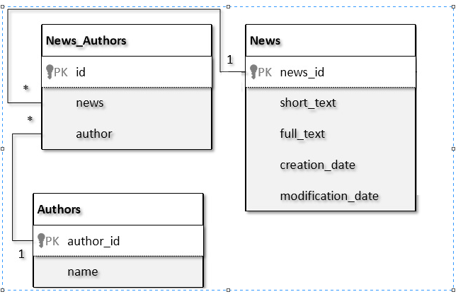

## Module 5. Backend: Spring Core Basics

**Task 1**: Write a web app for news hub portal.

In first iteration it should contain differently scoped services and beans, configuration (of any type),  profiles, tests.
UI part or Rest services are not nesessary until MVC iteration.
Local variables could be used right now, the real one or in-memory DB would be added on hibernate iteration.

Use Cases Within the application, the user should be able to: 
- Add news.
- Edit news.
- Delete news.
- View the list of news.
- View single news message.
- Get lit with news for specific author 

