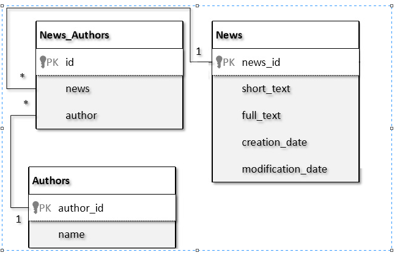

## Module 4. Backend: Web-services

**Task 1 (Web-Services Jersy JAX-RS)**: Implement REST API for news hub portal.

Use Cases Within the application, the user should be able to: 
- Add news.
- Edit news.
- Delete news.
- View the list of news.
- View single news message.
- Get lit with news for specific author 

